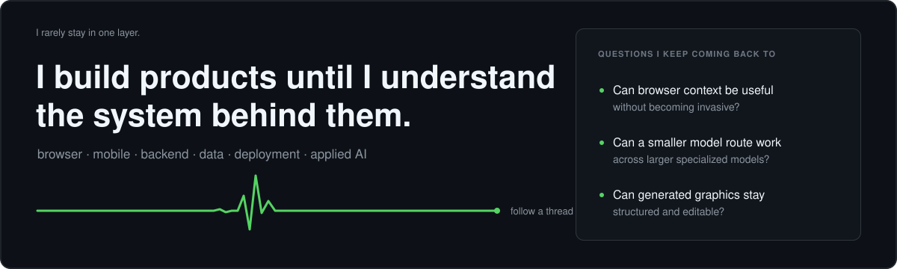
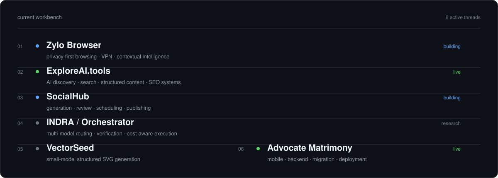
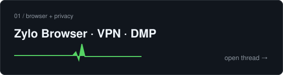
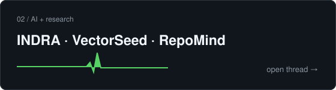
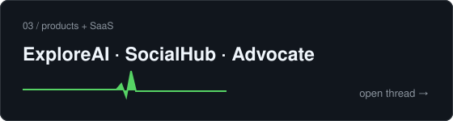
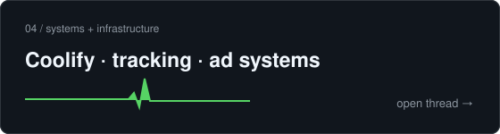

  

  <a href="https://www.linkedin.com/in/abhisec-tech/">LinkedIn</a>
  &nbsp;·&nbsp;
  <a href="mailto:abhisec.tech@gmail.com">Email</a>
  &nbsp;·&nbsp;
  <a href="https://exploreai.tools/">ExploreAI</a>

 

I build end-to-end systems — from product idea through frontend, backend, data, deployment, and the production problems that only appear after launch.

  

  <code>live</code> public product &nbsp;·&nbsp;
  <code>building</code> active work &nbsp;·&nbsp;
  <code>private</code> client / internal &nbsp;·&nbsp;
  <code>prototype</code> working experiment &nbsp;·&nbsp;
  <code>research</code> investigation &nbsp;·&nbsp;
  <code>concept</code> designed, not built &nbsp;·&nbsp;
  <code>archive</code> completed

---

### Start here

Pick the kind of problem you care about. No required order.

<table>
  <tr>
    <td width="50%" valign="top">
      
    </td>
    <td width="50%" valign="top">
      
    </td>
  </tr>
  <tr>
    <td width="50%" valign="top">
      
    </td>
    <td width="50%" valign="top">
      
    </td>
  </tr>
</table>

<strong>Things production taught me the hard way</strong>

 

- A Flutter VPN UI is the easy part. Keeping native connection state, providers, and platform bridges consistent across Android and iOS is where the architecture gets real.
- Migrating a production backend from MySQL to MongoDB made plugin timing, deployment behavior, and data shape part of the product problem — not just a database task.
- AI generation is only useful in production when model failure is expected. That is why routing, fallback, and verification keep appearing in my AI work.
- Browser personalization becomes a privacy architecture problem the moment context starts influencing recommendations.

---

## Project directory

55 projects across 8 areas. The directory stays collapsed on purpose — open only what interests you.

 

<strong>01 · Browser · Privacy · Intelligence</strong> &nbsp;&nbsp;<code>6</code>

 

| Project | State | Focus |
| :--- | :--- | :--- |
| **Zylo VPN** | `building` | Flutter VPN, subscriptions, server inventory, AtomSDK / PureWL, backend services |
| **Zylo Browser** | `building` | GeckoView / Chromium, privacy, VPN, ad blocking, search, contextual AI |
| **Zylo / Loki DMP** | `building` | Events, profiles, segmentation, intent, recommendation & prediction infrastructure |
| **Zylo Suggestive Ads** | `prototype` | Product-intent understanding and higher-value commerce recommendations |
| **Zylo Companion** | `prototype` | Contextual assistant around browsing behavior and product discovery |
| **LokiVPN Tracker** | `private` | Tracking and product utilities around the VPN ecosystem |

<strong>02 · ExploreAI Ecosystem</strong> &nbsp;&nbsp;<code>5</code>

 

| Project | State | Focus |
| :--- | :--- | :--- |
| **[ExploreAI.tools](https://exploreai.tools/)** | `live` | AI-tool discovery, categories, search, comparison, content & programmatic SEO |
| **ExploreAI Backend** | `private` | APIs, ingestion, categories, search, SEO data and content infrastructure |
| **ExploreAI Dashboard** | `private` | Admin control plane for tools, models, pages, SEO and generated content |
| **ExploreAI AI SEO Engine** | `private` | OpenRouter model selection / fallback for metadata, schemas and page generation |
| **ExploreAI Agent V2** | `building` | Agent-oriented frontend / backend evolution of ExploreAI |

<strong>03 · AI · Research · Generative Systems</strong> &nbsp;&nbsp;<code>7</code>

 

| Project | State | Focus |
| :--- | :--- | :--- |
| **INDRA / Multi-Model Orchestrator** | `research` | Classifier → scorer → orchestrator → specialized models → verifier |
| **VectorSeed / TinySVG** | `research` | Lightweight model research for structured, editable SVG generation |
| **RepoMind** | `prototype` | Repository-aware engineering agent with controlled modification and verification loops |
| **Offline / Personalized AI Engine** | `research` | Local context, intent classification, recommendation and privacy-aware personalization |
| **[Hive](https://github.com/Invens/hive)** | `prototype` | Public software / AI experimentation |
| **[OpenClaw](https://github.com/Invens/openclaw)** | `prototype` | Public agent / software exploration |
| **[LLM Chat App Template](https://github.com/Invens/llm-chat-app-template)** | `prototype` | LLM application architecture and chat-system experimentation |

<strong>04 · Products · SaaS · Applications</strong> &nbsp;&nbsp;<code>11</code>

 

| Project | State | Focus |
| :--- | :--- | :--- |
| **SocialHub** | `building` | AI generation, review, scheduling, publishing and analytics workflows |
| **Fluencerz** | `private` | Influencer marketing, creators, brands, campaigns, chat and admin workflows |
| **LokiSurf** | `building` | Gaming discovery, frontend, search, themes, SEO, dashboard and AI content |
| **DhanWise** | `concept` | Personal-finance intelligence, reconciled ledger and assistant workflows |
| **CleanMyBG** | `private` | Background-removal SaaS — auth, subscriptions, credits, payments, usage controls |
| **Advocate Matrimony** | `live` | Android product, Fastify / MongoDB backend, migration and deployment work |
| **IndiTeppich** | `private` | E-commerce storefront, backend, catalog and administrative workflows |
| **GrowwPaisa** | `private` | Finance / product web application with frontend and backend work |
| **Social Impact Platform** | `concept` | Discovery and documentation platform for social and humanitarian work |
| **CoupleUp** | `archive` | Relationship / matching application with frontend and backend systems |
| **Job Portal** | `prototype` | Employment marketplace and backend workflow project |

<strong>05 · Adtech · Affiliate · Commerce</strong> &nbsp;&nbsp;<code>12</code>

 

| Project | State | Focus |
| :--- | :--- | :--- |
| **AdStudioz Platform** | `private` | Advertising / publisher ecosystem and campaign platform components |
| **AdStudioz Tracking** | `private` | Event, attribution and conversion-tracking infrastructure |
| **Publisher.AdStudioz** | `private` | Publisher-facing advertising platform |
| **Affiliate Website Platform** | `building` | Product / comparison content, affiliate links, SEO, dashboard and Impact integration |
| **Affiliate Blog Engine** | `private` | Automated affiliate-content frontend / backend / dashboard stack |
| **DealskyPro** | `archive` | Products, reviews, deals and buying-guide platform |
| **EasyShopPrice** | `private` | Product discovery, price comparison and affiliate commerce system |
| **Amazon Affiliate Automation** | `prototype` | Affiliate product and publishing automation |
| **Trivogames / Trackier Signup Tracking** | `private` | Click-ID capture, attribution, signup pixel and campaign tracking integration |
| **DSP** | `prototype` | Demand-side advertising experiment |
| **Ads Tester** | `prototype` | Advertising integration / testing utilities |
| **Tracking Code** | `prototype` | Small attribution and tracking utility work |

<strong>06 · Media · Content Automation</strong> &nbsp;&nbsp;<code>2</code>

 

| Project | State | Focus |
| :--- | :--- | :--- |
| **CS Explainer Video Engine** | `prototype` | Topic → script → scenes → voice → captions → Remotion render pipeline |
| **Cat Grooming / Rescue Shorts Engine** | `building` | Repeatable 3-clip Veo storytelling and visual-continuity workflow |

<strong>07 · Infrastructure · DevOps · Enterprise</strong> &nbsp;&nbsp;<code>3</code>

 

| Project | State | Focus |
| :--- | :--- | :--- |
| **Lightweight Coolify-style Server Manager** | `concept` | Minimal Docker website / API management on Ubuntu |
| **Multi-Server Coolify Infrastructure** | `private` | Ubuntu, Docker, Coolify, remote servers and multi-service deployments |
| **Alonsa Group AI / Odoo System** | `concept` | Odoo workflows + AI-assisted OCR, catalog content and publishing pipeline |

<strong>08 · Earlier Builds</strong> &nbsp;&nbsp;<code>9</code>

 

| Project | State | Focus |
| :--- | :--- | :--- |
| **Wedding Manage** | `archive` | Wedding / event-management application |
| **Fashion** | `archive` | Earlier fashion application project |
| **FashionApp** | `archive` | Mobile fashion application iteration |
| **DesignIndianHomes** | `archive` | Home / design platform and dashboard iterations |
| **Boots & Crampons** | `archive` | Commercial / e-commerce frontend and backend work |
| **Tally9** | `archive` | Business / accounting-oriented application |
| **Gamora / Gamora.world** | `archive` | Web / application platform across multiple iterations |
| **GreenLantern** | `archive` | Earlier public software project |
| **AR Instant App** | `archive` | Augmented-reality / mobile experiment |

---

<strong>Tools I reach for most</strong>

 

`Python` · `TypeScript` · `JavaScript` · `Dart` · `Node.js` · `Fastify` · `Flutter` · `PyTorch` · `MySQL` · `MongoDB` · `Redis` · `Linux` · `Docker` · `Nginx` · `Coolify`

 

  If something here is relevant to what you're building, 
  <a href="mailto:abhisec.tech@gmail.com">email me</a> or find me on <a href="https://www.linkedin.com/in/abhisec-tech/">LinkedIn</a>.

