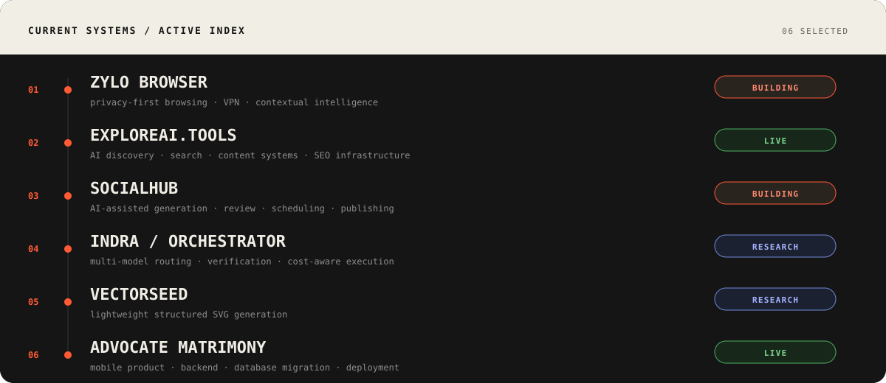
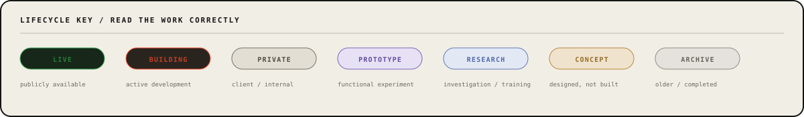

  

  <a href="https://www.linkedin.com/in/abhisec-tech/">LinkedIn</a>
  &nbsp;&nbsp;·&nbsp;&nbsp;
  <a href="mailto:abhisec.tech@gmail.com">Email</a>
  &nbsp;&nbsp;·&nbsp;&nbsp;
  <a href="https://exploreai.tools/">ExploreAI</a>

 

I work across **product engineering, AI systems, browsers, backend architecture and infrastructure**. This is an engineering archive, not a list of technologies: products that shipped, systems that stayed private, active builds, research, prototypes, concepts and older work all stay visible — with their lifecycle stated clearly.

 

  

 

  

 

  

 

<strong>01 / Browser · Privacy · Intelligence</strong> &nbsp; <code>06 projects</code>

 

| Project | State | Scope |
|---|---|---|
| **Zylo VPN** | `BUILDING` | Flutter VPN, subscriptions, server inventory, AtomSDK/PureWL, backend services |
| **Zylo Browser** | `BUILDING` | GeckoView/Chromium, privacy, VPN, ad blocking, search, contextual AI |
| **Zylo / Loki DMP** | `BUILDING` | Events, profiles, segmentation, intent, recommendation, prediction infrastructure |
| **Zylo Suggestive Ads** | `PROTOTYPE` | Product-intent understanding and better-value commerce recommendations |
| **Zylo Companion** | `PROTOTYPE` | Contextual assistant around browsing behavior and product discovery |
| **LokiVPN Tracker** | `PRIVATE` | Tracking and product utilities around the VPN ecosystem |

<strong>02 / ExploreAI Ecosystem</strong> &nbsp; <code>05 projects</code>

 

| Project | State | Scope |
|---|---|---|
| **[ExploreAI.tools](https://exploreai.tools/)** | `LIVE` | AI-tool discovery, categories, search, comparison, content and programmatic SEO |
| **ExploreAI Backend** | `PRIVATE` | APIs, ingestion, categories, search, SEO data and content infrastructure |
| **ExploreAI Dashboard** | `PRIVATE` | Admin control plane for tools, models, pages, SEO and generated content |
| **ExploreAI AI SEO Engine** | `PRIVATE` | OpenRouter model selection/fallback for metadata, schemas and page generation |
| **ExploreAI Agent V2** | `BUILDING` | Agent-oriented frontend/backend evolution of ExploreAI |

<strong>03 / AI · Research · Generative Systems</strong> &nbsp; <code>07 projects</code>

 

| Project | State | Scope |
|---|---|---|
| **INDRA / Multi-Model Orchestrator** | `RESEARCH` | Classifier → scorer → orchestrator → specialized models → verifier |
| **VectorSeed / TinySVG** | `RESEARCH` | Lightweight model research for structured, editable SVG generation |
| **RepoMind** | `PROTOTYPE` | Repository-aware engineering agent with controlled modification and verification loops |
| **Offline / Personalized AI Engine** | `RESEARCH` | Local context, intent classification, recommendation and privacy-aware personalization |
| **[Hive](https://github.com/Invens/hive)** | `PROTOTYPE` | Public software/AI experimentation |
| **[OpenClaw](https://github.com/Invens/openclaw)** | `PROTOTYPE` | Public agent/software exploration |
| **[LLM Chat App Template](https://github.com/Invens/llm-chat-app-template)** | `PROTOTYPE` | LLM application architecture and chat-system experimentation |

<strong>04 / Products · SaaS · Application Platforms</strong> &nbsp; <code>11 projects</code>

 

| Project | State | Scope |
|---|---|---|
| **SocialHub** | `BUILDING` | AI generation, review, scheduling, publishing and analytics workflows |
| **Fluencerz** | `PRIVATE` | Influencer marketing, creators, brands, campaigns, chat and admin workflows |
| **LokiSurf** | `BUILDING` | Gaming discovery, frontend, search, themes, SEO, dashboard and AI content |
| **DhanWise** | `CONCEPT` | Personal-finance intelligence, reconciled ledger and assistant workflows |
| **CleanMyBG** | `PRIVATE` | Background-removal SaaS, auth, subscriptions, credits, payments and usage controls |
| **Advocate Matrimony** | `LIVE` | Android product, Fastify/MongoDB backend, migration and deployment work |
| **IndiTeppich** | `PRIVATE` | E-commerce storefront, backend, catalog and administrative workflows |
| **GrowwPaisa** | `PRIVATE` | Finance/product web application with frontend and backend work |
| **Social Impact Platform** | `CONCEPT` | Discovery and documentation platform for social and humanitarian work |
| **CoupleUp** | `ARCHIVE` | Relationship/matching application with frontend and backend systems |
| **Job Portal** | `PROTOTYPE` | Employment marketplace and backend workflow project |

<strong>05 / AdTech · Affiliate · Commerce</strong> &nbsp; <code>12 projects</code>

 

| Project | State | Scope |
|---|---|---|
| **AdStudioz Platform** | `PRIVATE` | Advertising/publisher ecosystem and campaign platform components |
| **AdStudioz Tracking** | `PRIVATE` | Event, attribution and conversion-tracking infrastructure |
| **Publisher.AdStudioz** | `PRIVATE` | Publisher-facing advertising platform |
| **Affiliate Website Platform** | `BUILDING` | Product/comparison content, affiliate links, SEO, dashboard and Impact integration |
| **Affiliate Blog Engine** | `PRIVATE` | Automated affiliate-content frontend/backend/dashboard stack |
| **DealskyPro** | `ARCHIVE` | Products, reviews, deals and buying-guide platform |
| **EasyShopPrice** | `PRIVATE` | Product discovery, price comparison and affiliate commerce system |
| **Amazon Affiliate Automation** | `PROTOTYPE` | Affiliate product and publishing automation |
| **Trivogames / Trackier Signup Tracking** | `PRIVATE` | Click-ID capture, attribution, signup pixel and campaign tracking integration |
| **DSP** | `PROTOTYPE` | Demand-side advertising experiment |
| **Ads Tester** | `PROTOTYPE` | Advertising integration/testing utilities |
| **Tracking Code** | `PROTOTYPE` | Small attribution and tracking utility work |

<strong>06 / Media · Content Automation</strong> &nbsp; <code>02 projects</code>

 

| Project | State | Scope |
|---|---|---|
| **CS Explainer Video Engine** | `PROTOTYPE` | Topic → script → scenes → voice → captions → Remotion render pipeline |
| **Cat Grooming / Rescue Shorts Engine** | `BUILDING` | Repeatable 3-clip Veo storytelling and visual continuity workflow |

<strong>07 / Infrastructure · DevOps · Enterprise</strong> &nbsp; <code>03 projects</code>

 

| Project | State | Scope |
|---|---|---|
| **Lightweight Coolify-style Server Manager** | `CONCEPT` | Minimal Docker website/API management on Ubuntu |
| **Multi-Server Coolify Infrastructure** | `PRIVATE` | Ubuntu, Docker, Coolify, remote servers and multi-service deployments |
| **Alonsa Group AI / Odoo System** | `CONCEPT` | Odoo workflows plus AI-assisted OCR, catalog content and publishing pipeline |

<strong>08 / Earlier Builds · Experiments</strong> &nbsp; <code>09 projects</code>

 

| Project | State | Scope |
|---|---|---|
| **Wedding Manage** | `ARCHIVE` | Wedding/event-management application |
| **Fashion** | `ARCHIVE` | Earlier fashion application project |
| **FashionApp** | `ARCHIVE` | Mobile fashion application iteration |
| **DesignIndianHomes** | `ARCHIVE` | Home/design platform and dashboard iterations |
| **Boots & Crampons** | `ARCHIVE` | Commercial/e-commerce frontend and backend work |
| **Tally9** | `ARCHIVE` | Business/accounting-oriented application |
| **Gamora / Gamora.world** | `ARCHIVE` | Web/application platform across multiple iterations |
| **GreenLantern** | `ARCHIVE` | Earlier public software project |
| **AR Instant App** | `ARCHIVE` | Augmented-reality/mobile experiment |

 

> **OPERATING NOTE** — Understand the system → reduce unnecessary layers → build the smallest useful path → instrument failure → ship → learn from production.

<strong>Runtime / current tools</strong>

 

`Python` · `TypeScript` · `JavaScript` · `Dart` · `Node.js` · `Fastify` · `Flutter` · `PyTorch` · `MySQL` · `MongoDB` · `Redis` · `Linux` · `Docker` · `Nginx` · `Coolify`

The stack changes by problem; it is not the identity of the work.

 

  <strong>ABHISHEK KUMAR</strong> 
  Software Engineer · India  
  <a href="https://www.linkedin.com/in/abhisec-tech/">LinkedIn</a>
  &nbsp;·&nbsp;
  <a href="mailto:abhisec.tech@gmail.com">abhisec.tech@gmail.com</a>

