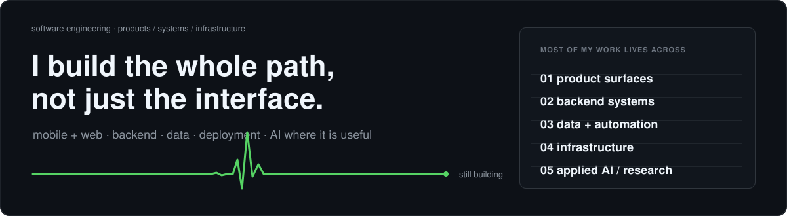

  

  <a href="https://www.linkedin.com/in/abhisec-tech/">LinkedIn</a>
  &nbsp;·&nbsp;
  <a href="mailto:abhisec.tech@gmail.com">Email</a>
  &nbsp;·&nbsp;
  <a href="https://exploreai.tools/">ExploreAI</a>

I usually work end-to-end: product idea, frontend/mobile, backend, data, deployment, and the production problems that show up after launch.

  

`live` public product · `building` active work · `private` client/internal · `prototype` working experiment · `research` investigation/training · `concept` designed, not built · `archive` older/completed

---

## project directory

55 projects across 8 areas. Most details stay collapsed so the profile remains readable.

 

<strong>01 / browser · privacy · intelligence</strong> &nbsp; <code>06</code>

 

| Project | State | Notes |
|---|---|---|
| **Zylo VPN** | `building` | Flutter VPN, subscriptions, server inventory, AtomSDK/PureWL, backend services |
| **Zylo Browser** | `building` | GeckoView/Chromium, privacy, VPN, ad blocking, search, contextual AI |
| **Zylo / Loki DMP** | `building` | events, profiles, segmentation, intent, recommendation and prediction infrastructure |
| **Zylo Suggestive Ads** | `prototype` | product-intent understanding and better-value commerce recommendations |
| **Zylo Companion** | `prototype` | contextual assistant around browsing behavior and product discovery |
| **LokiVPN Tracker** | `private` | tracking and product utilities around the VPN ecosystem |

<strong>02 / ExploreAI ecosystem</strong> &nbsp; <code>05</code>

 

| Project | State | Notes |
|---|---|---|
| **[ExploreAI.tools](https://exploreai.tools/)** | `live` | AI-tool discovery, categories, search, comparison, content and programmatic SEO |
| **ExploreAI Backend** | `private` | APIs, ingestion, categories, search, SEO data and content infrastructure |
| **ExploreAI Dashboard** | `private` | admin control plane for tools, models, pages, SEO and generated content |
| **ExploreAI AI SEO Engine** | `private` | OpenRouter model selection/fallback for metadata, schemas and page generation |
| **ExploreAI Agent V2** | `building` | agent-oriented frontend/backend evolution of ExploreAI |

<strong>03 / AI · research · generative systems</strong> &nbsp; <code>07</code>

 

| Project | State | Notes |
|---|---|---|
| **INDRA / Multi-Model Orchestrator** | `research` | classifier → scorer → orchestrator → specialized models → verifier |
| **VectorSeed / TinySVG** | `research` | lightweight model research for structured, editable SVG generation |
| **RepoMind** | `prototype` | repository-aware engineering agent with controlled modification and verification loops |
| **Offline / Personalized AI Engine** | `research` | local context, intent classification, recommendation and privacy-aware personalization |
| **[Hive](https://github.com/Invens/hive)** | `prototype` | public software/AI experimentation |
| **[OpenClaw](https://github.com/Invens/openclaw)** | `prototype` | public agent/software exploration |
| **[LLM Chat App Template](https://github.com/Invens/llm-chat-app-template)** | `prototype` | LLM application architecture and chat-system experimentation |

<strong>04 / products · SaaS · applications</strong> &nbsp; <code>11</code>

 

| Project | State | Notes |
|---|---|---|
| **SocialHub** | `building` | AI generation, review, scheduling, publishing and analytics workflows |
| **Fluencerz** | `private` | influencer marketing, creators, brands, campaigns, chat and admin workflows |
| **LokiSurf** | `building` | gaming discovery, frontend, search, themes, SEO, dashboard and AI content |
| **DhanWise** | `concept` | personal-finance intelligence, reconciled ledger and assistant workflows |
| **CleanMyBG** | `private` | background-removal SaaS, auth, subscriptions, credits, payments and usage controls |
| **Advocate Matrimony** | `live` | Android product, Fastify/MongoDB backend, migration and deployment work |
| **IndiTeppich** | `private` | e-commerce storefront, backend, catalog and administrative workflows |
| **GrowwPaisa** | `private` | finance/product web application with frontend and backend work |
| **Social Impact Platform** | `concept` | discovery and documentation platform for social and humanitarian work |
| **CoupleUp** | `archive` | relationship/matching application with frontend and backend systems |
| **Job Portal** | `prototype` | employment marketplace and backend workflow project |

<strong>05 / adtech · affiliate · commerce</strong> &nbsp; <code>12</code>

 

| Project | State | Notes |
|---|---|---|
| **AdStudioz Platform** | `private` | advertising/publisher ecosystem and campaign platform components |
| **AdStudioz Tracking** | `private` | event, attribution and conversion-tracking infrastructure |
| **Publisher.AdStudioz** | `private` | publisher-facing advertising platform |
| **Affiliate Website Platform** | `building` | product/comparison content, affiliate links, SEO, dashboard and Impact integration |
| **Affiliate Blog Engine** | `private` | automated affiliate-content frontend/backend/dashboard stack |
| **DealskyPro** | `archive` | products, reviews, deals and buying-guide platform |
| **EasyShopPrice** | `private` | product discovery, price comparison and affiliate commerce system |
| **Amazon Affiliate Automation** | `prototype` | affiliate product and publishing automation |
| **Trivogames / Trackier Signup Tracking** | `private` | click-ID capture, attribution, signup pixel and campaign tracking integration |
| **DSP** | `prototype` | demand-side advertising experiment |
| **Ads Tester** | `prototype` | advertising integration/testing utilities |
| **Tracking Code** | `prototype` | small attribution and tracking utility work |

<strong>06 / media · content automation</strong> &nbsp; <code>02</code>

 

| Project | State | Notes |
|---|---|---|
| **CS Explainer Video Engine** | `prototype` | topic → script → scenes → voice → captions → Remotion render pipeline |
| **Cat Grooming / Rescue Shorts Engine** | `building` | repeatable 3-clip Veo storytelling and visual-continuity workflow |

<strong>07 / infrastructure · DevOps · enterprise</strong> &nbsp; <code>03</code>

 

| Project | State | Notes |
|---|---|---|
| **Lightweight Coolify-style Server Manager** | `concept` | minimal Docker website/API management on Ubuntu |
| **Multi-Server Coolify Infrastructure** | `private` | Ubuntu, Docker, Coolify, remote servers and multi-service deployments |
| **Alonsa Group AI / Odoo System** | `concept` | Odoo workflows plus AI-assisted OCR, catalog content and publishing pipeline |

<strong>08 / earlier builds</strong> &nbsp; <code>09</code>

 

| Project | State | Notes |
|---|---|---|
| **Wedding Manage** | `archive` | wedding/event-management application |
| **Fashion** | `archive` | earlier fashion application project |
| **FashionApp** | `archive` | mobile fashion application iteration |
| **DesignIndianHomes** | `archive` | home/design platform and dashboard iterations |
| **Boots & Crampons** | `archive` | commercial/e-commerce frontend and backend work |
| **Tally9** | `archive` | business/accounting-oriented application |
| **Gamora / Gamora.world** | `archive` | web/application platform across multiple iterations |
| **GreenLantern** | `archive` | earlier public software project |
| **AR Instant App** | `archive` | augmented-reality/mobile experiment |

---

<strong>tools I use often</strong>

 

`Python` · `TypeScript` · `JavaScript` · `Dart` · `Node.js` · `Fastify` · `Flutter` · `PyTorch` · `MySQL` · `MongoDB` · `Redis` · `Linux` · `Docker` · `Nginx` · `Coolify`

 

  <a href="https://www.linkedin.com/in/abhisec-tech/">LinkedIn</a> · <a href="mailto:abhisec.tech@gmail.com">abhisec.tech@gmail.com</a>

