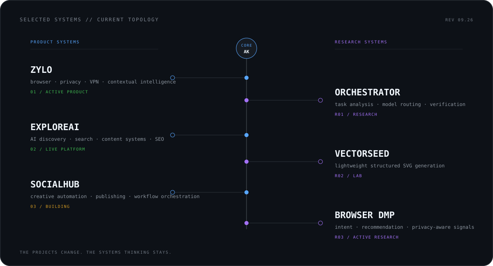

<p align="center">
  
</p>

<p align="center">
  <code>THIS IS NOT A SKILL INVENTORY.</code>&nbsp;&nbsp;
  <code>IT IS A MAP OF THE SYSTEMS I KEEP TRYING TO BUILD BETTER.</code>
</p>

<br/>

Most software profiles answer **“what tools do you know?”**

I’m more interested in a different question:

> **Can a product observe enough context to make a useful decision, act on it reliably, and remain understandable in production?**

That question keeps showing up in the things I build — browsers, AI systems, recommendation infrastructure, publishing automation, developer tools, and production backends.

<br/>

<p align="center">
  
</p>

<details>
<summary><code>OPEN /selected-build-notes</code></summary>
<br/>

**ZYLO** — browser + privacy infrastructure combining mobile delivery, VPN, contextual intelligence, and recommendation systems.

**EXPLOREAI** — AI discovery infrastructure around search, structured content, SEO automation, and tooling for a fast-changing ecosystem. → [exploreai.tools](https://exploreai.tools/)

**SOCIALHUB** — creative publishing infrastructure that treats generation, review, scheduling, and distribution as one system instead of disconnected automation scripts.

**ORCHESTRATOR** — research into task classification, model routing, cost-aware execution, verification, and multi-model workflows.

**VECTORSEED** — experiments in lightweight models that generate editable SVG structure instead of treating graphics only as pixels.

**BROWSER DMP** — intent and recommendation infrastructure around browsing context, privacy boundaries, and user-value-first suggestions.

</details>

<br/>

<p align="center">
  
</p>

<br/>

### `OPERATING RULE`

```text
observe the real system
        ↓
model the boundary
        ↓
remove unnecessary layers
        ↓
build the smallest useful path
        ↓
instrument failure
        ↓
ship
        ↓
learn from production
```

I care about the layer between **“it works”** and **“it survives production.”**

<br/>

<p align="center">
  
</p>

<br/>

### `PUBLIC PORTS`

[`hive`](https://github.com/Invens/hive) &nbsp;·&nbsp; [`openclaw`](https://github.com/Invens/openclaw) &nbsp;·&nbsp; [`llm-chat-app-template`](https://github.com/Invens/llm-chat-app-template) &nbsp;·&nbsp; [`exploreai.tools`](https://exploreai.tools/)

<sub>Most production systems I work on are private; the public graph is only one surface of the work.</sub>

<br/>

```text
NETWORK  //  linkedin.com/in/abhisec-tech  //  abhisec.tech@gmail.com  //  India
```

<p align="center">
  <sub><code>INVENS / ABHISHEK KUMAR / BUILD → OBSERVE → REBUILD</code></sub>
</p>
