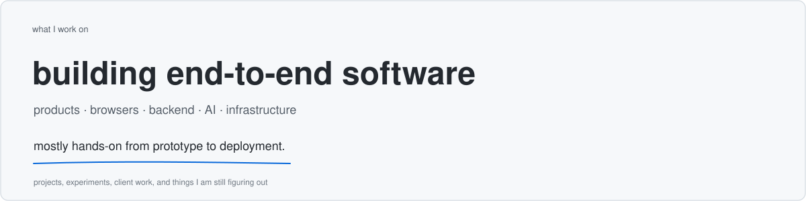
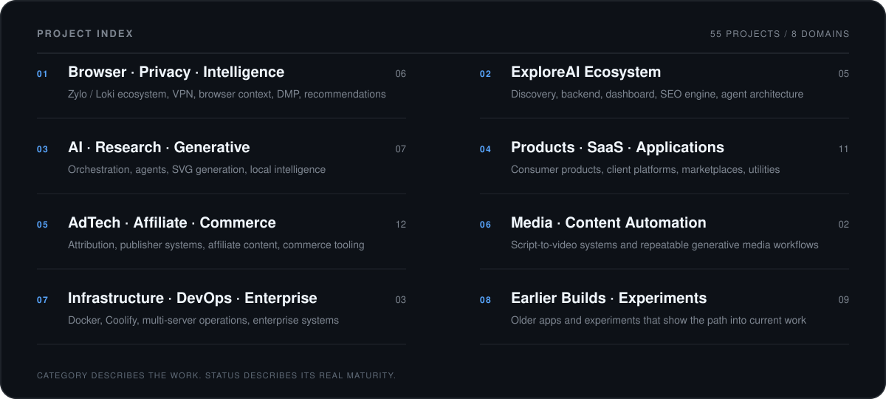
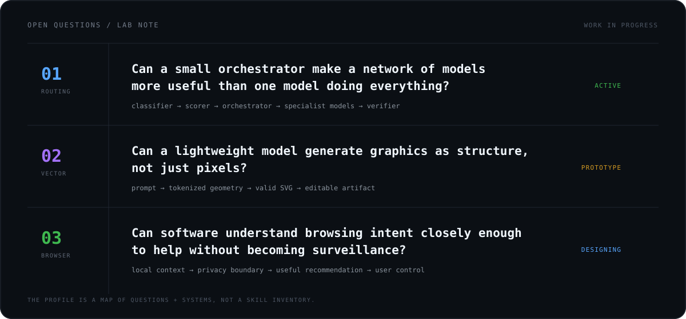
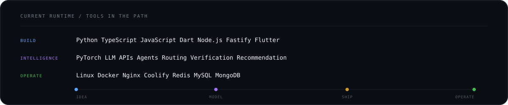

<p align="center">
  
</p>

<p align="center">
  <code>55 PROJECTS</code>&nbsp;&nbsp;·&nbsp;&nbsp;<code>8 DOMAINS</code>&nbsp;&nbsp;·&nbsp;&nbsp;<code>ONE ENGINEERING GRAPH</code>
</p>

<br/>

Most software profiles answer **“what tools do you know?”**

I prefer showing the systems I have actually built, researched, shipped, operated, or explored.

<p align="center">
  
</p>

---

## `01 // BROWSER · PRIVACY · INTELLIGENCE`

The Zylo/Loki family: browser surfaces, VPN infrastructure, behavioral context, recommendations, and privacy-aware intelligence.

| Project | What it is |
|---|---|
| **Zylo VPN** | Flutter Android/iOS VPN product with subscriptions, server inventory, PureWL/AtomSDK integration, notifications, and backend services. |
| **Zylo Browser** | GeckoView/Chromium browser work combining privacy, VPN, ad blocking, search, and contextual AI. |
| **Zylo / Loki DMP** | Browsing-event, profile, segmentation, intent, recommendation, and prediction infrastructure. |
| **Zylo Suggestive Ads** | User-value-first commerce recommendation layer that looks for better alternatives instead of simply showing another ad. |
| **Zylo Companion** | Contextual assistant layer around browsing behavior, products, and user intent. |
| **LokiVPN Tracker** | Product/tracking utilities around the VPN ecosystem. |

---

## `02 // EXPLOREAI ECOSYSTEM`

A complete AI-discovery stack rather than a single directory website.

| Project | What it is |
|---|---|
| **ExploreAI.tools** | AI discovery platform with tools, categories, search, comparison, content, and programmatic SEO. |
| **ExploreAI Backend** | APIs, ingestion, categories, search, SEO data, and content infrastructure. |
| **ExploreAI Dashboard** | Administrative control plane for tools, models, pages, SEO, and generated content. |
| **ExploreAI AI SEO Engine** | OpenRouter-based model selection/fallback pipeline for titles, metadata, schemas, and page content. |
| **ExploreAI Agent V2** | Agent-oriented evolution of ExploreAI with AI-assisted discovery and a separate frontend/backend architecture. |

---

## `03 // AI · RESEARCH · GENERATIVE SYSTEMS`

Projects where the main problem is intelligence, orchestration, generation, or autonomous software behavior.

| Project | What it is |
|---|---|
| **INDRA / Multi-Model Orchestrator** | Classifier → scorer → orchestrator → specialized models → verifier architecture for cost-aware multi-model execution. |
| **VectorSeed / TinySVG** | Lightweight generative model research for producing structured, editable SVG graphics. |
| **RepoMind** | Local repository-aware coding/engineering agent concept with controlled modification and verification loops. |
| **Offline / Personalized AI Engine** | Local/contextual intelligence using user-owned context, intent classification, recommendation, and privacy-aware personalization. |
| **Hive** | Public software/AI experimentation repository in the current engineering graph. |
| **OpenClaw** | Large public repository used as part of ongoing software and agent exploration. |
| **LLM Chat App Template** | Public LLM application/template for experimenting with production chat/application architecture. |

---

## `04 // PRODUCTS · SAAS · APPLICATION PLATFORMS`

End-user products, commercial SaaS systems, marketplaces, utilities, and client-facing applications.

| Project | What it is |
|---|---|
| **SocialHub** | AI-first social publishing system for generation, review, scheduling, platform formatting, publishing, and analytics. |
| **Fluencerz** | Influencer marketing platform with creators, brands, campaigns, applications, restricted chat, ratings, and admin workflows. |
| **LokiSurf** | Gaming/discovery platform with custom frontend, search, themes, SEO, dashboard, and AI-generated page metadata/content. |
| **DhanWise** | Personal-finance intelligence concept covering transaction ingestion, ledger reconciliation, spending insights, and assistant workflows. |
| **CleanMyBG** | Background-removal SaaS with frontend/backend, authentication, subscriptions, credits, payments, and usage enforcement. |
| **Advocate Matrimony** | Production Android/client platform with backend ownership, Fastify, MongoDB, deployment, and database migration work. |
| **IndiTeppich** | Full e-commerce platform spanning storefront, backend, product/catalog workflows, and administrative operations. |
| **GrowwPaisa** | Finance/product web application with separate frontend/backend work. |
| **Social Impact Platform** | Product concept for documenting and discovering humanitarian, environmental, rescue, and community-impact workers. |
| **CoupleUp** | Relationship/matching application with separate frontend and backend systems. |
| **Job Portal** | Employment/job marketplace application and backend workflow project. |

---

## `05 // ADTECH · AFFILIATE · COMMERCE`

Tracking, attribution, publishing, affiliate content, recommendation, and monetization infrastructure.

| Project | What it is |
|---|---|
| **AdStudioz Platform** | Advertising/publisher ecosystem with campaign and platform components. |
| **AdStudioz Tracking** | Event, attribution, and conversion-tracking infrastructure. |
| **Publisher.AdStudioz** | Publisher-facing advertising platform. |
| **Affiliate Website Platform** | Product/comparison content system with affiliate links, SEO, dashboards, and Impact integration. |
| **Affiliate Blog Engine** | Automated affiliate-content frontend/backend/dashboard stack. |
| **DealskyPro** | Multi-niche products, reviews, deals, and buying-guide platform. |
| **EasyShopPrice** | Product-discovery / price-comparison / affiliate commerce system. |
| **Amazon Affiliate Automation** | Automation around Amazon affiliate workflows and product publishing. |
| **Trivogames / Trackier Signup Tracking** | Click-ID capture, publisher attribution, signup conversion pixel, and campaign tracking integration. |
| **DSP** | Advertising / demand-side-platform experiment. |
| **Ads Tester** | Advertising integration and testing utilities. |
| **Tracking Code** | Small tracking/integration utility project. |

---

## `06 // MEDIA · CONTENT AUTOMATION`

Systems that convert structured ideas into repeatable media output.

| Project | What it is |
|---|---|
| **CS Explainer Video Engine** | Topic → script → scene model → voice → captions → Remotion render pipeline for computer-science Shorts. |
| **Cat Grooming / Rescue Shorts Engine** | 30-second, 3-clip Veo storytelling framework with character lock, grooming transformation, and emotional endings. |

---

## `07 // INFRASTRUCTURE · DEVOPS · ENTERPRISE`

Deployment, server operations, enterprise workflows, and systems that support other products.

| Project | What it is |
|---|---|
| **Lightweight Coolify-style Server Manager** | Concept for managing Docker-hosted websites and APIs on Ubuntu with minimal operational overhead. |
| **Multi-Server Coolify Infrastructure** | Real deployment work across Ubuntu, Docker, Coolify, remote servers, frontends, backends, and dashboards. |
| **Alonsa Group AI / Odoo System** | Enterprise Odoo architecture plus AI-assisted product capture, OCR, content generation, approval, and catalog publishing. |

---

## `08 // EARLIER BUILDS · EXPERIMENTS`

Older projects matter because they show the path before the current systems became larger and more architectural.

| Project | What it is |
|---|---|
| **Wedding Manage** | Wedding/event-management application. |
| **Fashion** | Earlier fashion application project. |
| **FashionApp** | Mobile/application iteration around fashion workflows. |
| **DesignIndianHomes** | Home/design platform with main application and dashboard iterations. |
| **Boots & Crampons** | Earlier commercial/e-commerce system with frontend/backend work. |
| **Tally9** | Business/accounting-oriented application project. |
| **Gamora / Gamora.world** | Web/application platform developed across multiple repository iterations. |
| **GreenLantern** | Earlier public software project. |
| **AR Instant App** | Augmented-reality/mobile application experiment. |

---

<p align="center">
  
</p>

### `OPERATING RULE`

```text
observe the real system
        ↓
model the boundary
        ↓
remove unnecessary layers
        ↓
build the smallest useful path
        ↓
instrument failure
        ↓
ship
        ↓
learn from production
```

I care about the layer between **“it works”** and **“it survives production.”**

<p align="center">
  
</p>

### `PUBLIC PORTS`

[`hive`](https://github.com/Invens/hive) &nbsp;·&nbsp; [`openclaw`](https://github.com/Invens/openclaw) &nbsp;·&nbsp; [`llm-chat-app-template`](https://github.com/Invens/llm-chat-app-template) &nbsp;·&nbsp; [`exploreai.tools`](https://exploreai.tools/)

<sub>Many production systems are private; the public repository graph is only one surface of the work.</sub>

<br/>

```text
NETWORK  //  linkedin.com/in/abhisec-tech  //  abhisec.tech@gmail.com  //  India
```

<p align="center">
  <sub><code>INVENS / ABHISHEK KUMAR / BUILD → OBSERVE → REBUILD</code></sub>
</p>
